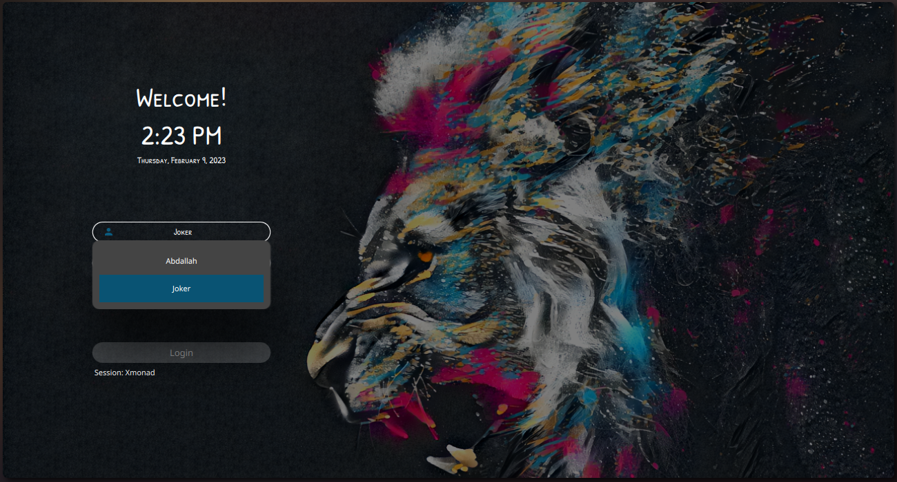
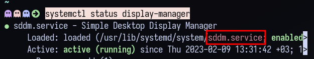

# Al-swaiti login theme for SDDM

### Dependencies

[`sddm >= 0.18.0`](https://github.com/sddm/sddm), [`qt5 >= 5.11.0`](http://doc.qt.io/qt-5/index.html), [`qt5-quickcontrols2 >= 5.11.0`](http://doc.qt.io/qt-5/qtquickcontrols2-index.html), [`qt5-svg >= 5.11.0`](https://doc.qt.io/qt-5/qtsvg-index.html)

**Debian based** distros using the **APT** package manager:  
*(Ubuntu/Kubuntu/Kali/Neon/antiX etc.)*  
<pre>sudo apt install --no-install-recommends sddm sddm-kcm</pre>  

**Arch based** distros using the **pacman** package manger:  
*(Obarun/Artix/Manjaro/KaOS/Chakra etc.)*  
<pre>sudo pacman -S --needed sddm sddm-kcm</pre>  

**openSUSE** using the **zypper** package manager:  
<pre>sudo zypper install sddm sddm-kcm</pre>  

**Red Hat** based distros using the **dnf** package manager:  
*(Fedora/Mageia/RHEL/CentOS)*  
<pre>sudo dnf install sddm sddm-kcm</pre>  

<br/><br/>


```
 sudo tar -xzvf ~/Downloads/sugar-dark.tar.gz -C /usr/share/sddm/themes
```
### Instalation

First be sure that sddm is your default


```
systemctl status display-manager
```
If you have another display-manager (ex:gdm):
```
sudo systemctl disable gdm.service
```

Then:
```
sudo systemctl enable sddm.service
```

Now you have to set [theme] inside sddm.conf
preferrably at `/etc/sddm.conf.d/default.conf`
sometimes `/etc/sddm.conf.d/kde_settings.conf`
**the name it's not important**
if you didnt find any you can create one by :
```
sudo cp /usr/lib/sddm/sddm.conf.d/default.conf /etc/sddm.conf.d/  
```

Now edit file 
```
sudo nano /etc/sddm.conf.d/default.conf
```
  

In the `[Theme]` section simply add the themes name: `Current=al-swaiti`.
as below


 Also see the [Arch wiki on SDDM](https://wiki.archlinux.org/index.php/SDDM).


 donation on my [PayPayl](https://paypal.me/abdallalswaiti) or [patreon](https://www.patreon.com/user?u=88585798) account for a cup of coffee.  

